# Multi-Cloud DevSecOps Infrastructure Automation Platform

A hands-on multi-cloud infrastructure engineering project designed to automate, secure, validate, monitor, and operate infrastructure across **Amazon Web Services (AWS)** and **Microsoft Azure** using Terraform, GitHub Actions, Infrastructure as Code (IaC), federated identity, automated security scanning, monitoring, logging, and DevSecOps practices.

The platform was developed incrementally through **11 engineering phases**, progressing from foundational AWS networking to multi-cloud infrastructure, secure CI/CD, reusable Terraform modules, security hardening, observability, state-aware refactoring, and full infrastructure lifecycle management.

---

## Project Status

**Project 3: COMPLETE**

```text
Infrastructure Engineering       COMPLETE
AWS Infrastructure               COMPLETE
Azure Infrastructure             COMPLETE
Terraform IaC                    COMPLETE
AWS CI/CD                        COMPLETE
Azure CI/CD                      COMPLETE
GitHub OIDC Federation           COMPLETE
Security Hardening               COMPLETE
Terraform Modularization         COMPLETE
AWS Observability                COMPLETE
Azure Observability              COMPLETE
Infrastructure Validation        COMPLETE
AWS Lifecycle Teardown           COMPLETE
Portfolio Documentation          COMPLETE
```

---

## Project Objectives

This project demonstrates practical Cloud, Infrastructure, DevOps, and DevSecOps engineering capabilities across:

- Amazon Web Services (AWS)
- Microsoft Azure
- Terraform Infrastructure as Code
- Multi-cloud networking
- Linux workload deployment
- Identity and access management
- Git-based infrastructure change management
- GitHub Actions CI/CD
- OpenID Connect federation
- Infrastructure security scanning
- Automated validation
- Reusable Terraform modules
- State-aware infrastructure refactoring
- Centralized logging
- Infrastructure monitoring
- Metric-based alerting
- Secure remote Terraform state
- Infrastructure lifecycle management
- Cloud cost-conscious teardown

---

# Architecture Overview

The completed platform implemented equivalent infrastructure engineering patterns across AWS and Azure while using cloud-native services appropriate to each provider.

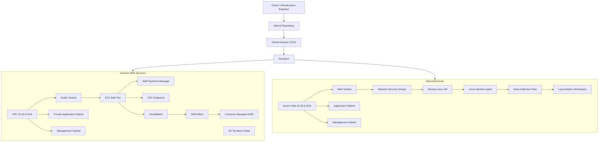

---

# CI/CD and Federated Identity Architecture

Both cloud environments were integrated with GitHub Actions using short-lived federated credentials rather than storing permanent cloud credentials in GitHub.

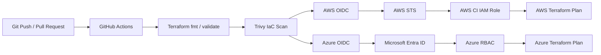

The architecture eliminates long-lived cloud access keys from the GitHub CI/CD workflow.

---

# AWS Architecture

## AWS Environment

**Region:** `eu-central-1` (Frankfurt)

**VPC:** `10.20.0.0/16`

| Network Tier | CIDR | Purpose |
| --- | --- | --- |
| Public | `10.20.1.0/24` | Internet-facing workload |
| Private Application | `10.20.10.0/24` | Private application workloads |
| Management | `10.20.20.0/24` | Infrastructure management |

The public subnet used a dedicated route table with a default IPv4 route through an AWS Internet Gateway.

Private application and management networks remained isolated from direct Internet Gateway routing.

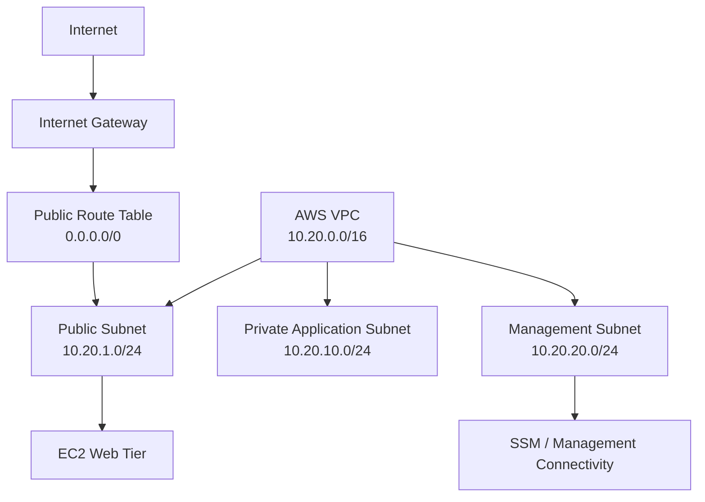

---

## AWS Infrastructure Implemented

The AWS environment included:

- VPC with DNS support and DNS hostnames
- Public subnet
- Private application subnet
- Management subnet
- Internet Gateway
- Dedicated public route table
- Default Internet route
- Public subnet route-table association
- Web security group
- Application security group
- VPC endpoint security group
- Controlled ingress and egress rules
- EC2 web tier
- Amazon Linux 2023 ARM64
- `t4g.micro` compute
- Encrypted GP3 EBS storage
- IMDSv2 enforcement
- EC2 IAM role and instance profile
- AWS Systems Manager
- S3 Gateway VPC Endpoint
- SSM Interface VPC Endpoint
- SSM Messages Interface VPC Endpoint
- CloudWatch Logs VPC Endpoint
- Nginx web service
- CloudWatch logging
- CloudWatch alarms
- SNS alerting
- Customer-managed KMS encryption
- Terraform resource tagging
- Terraform outputs
- IAM Identity Center
- GitHub OIDC federation
- Remote Terraform state using S3

All workload infrastructure was created and managed through Terraform.

---

# Azure Architecture

The Azure implementation provided the second cloud environment for the project.

**Region:** UK South

**VNet:** `10.30.0.0/16`

The Azure architecture included:

- Azure Virtual Network
- Web subnet
- Application subnet
- Management subnet
- Network Security Groups
- Static Standard Public IP
- Network Interface
- Ubuntu 24.04 LTS Linux VM
- ED25519 SSH authentication
- System-assigned Managed Identity
- Nginx
- Azure Storage remote Terraform state
- Microsoft Entra identity integration
- GitHub Actions OIDC
- Azure RBAC
- Azure Monitor Agent
- Data Collection Rule
- Log Analytics Workspace
- CPU metrics
- Memory metrics
- Disk metrics

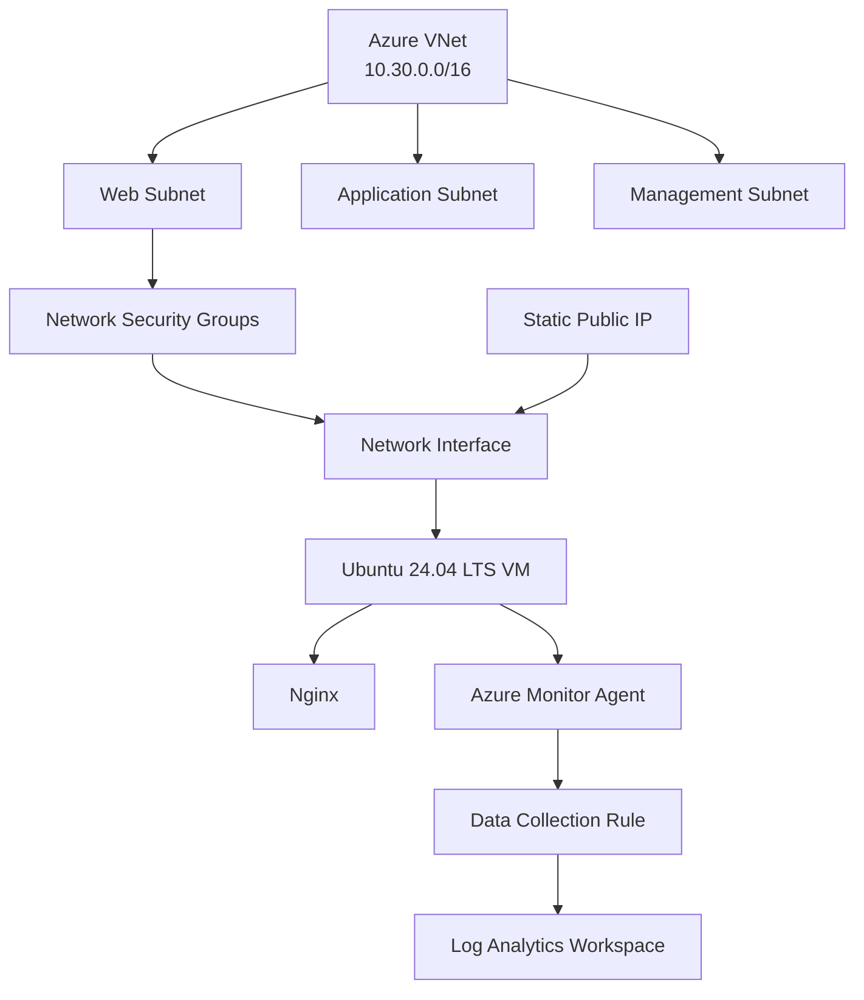

---

# Infrastructure as Code Workflow

Infrastructure changes followed a controlled lifecycle:

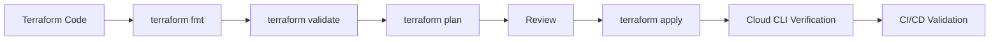

This provided repeatable infrastructure deployment and independent validation.

---

# Identity and Access Management

## AWS Local Administration

AWS local administration used IAM Identity Center and temporary credentials.

```text
AWS IAM Identity Center
        |
        v
Federated User
        |
        v
Permission Set
        |
        v
Temporary Credentials
        |
        v
AWS CLI / Terraform
```

This avoided permanent AWS access keys on the engineering workstation.

---

## AWS GitHub OIDC

```text
GitHub Repository
       |
       v
GitHub Actions
       |
       v
GitHub OIDC Token
       |
       v
AWS STS
       |
       v
GitHub Actions IAM Role
       |
       v
Terraform / AWS APIs
```

The GitHub Actions role used controlled permissions required for Terraform state access and infrastructure refresh.

---

## Azure GitHub OIDC

The Azure CI/CD architecture used:

- GitHub Actions OIDC
- Microsoft Entra application
- Service principal
- Federated identity credential
- Resource-group scoped Azure Contributor RBAC
- GitHub repository variables
- Short-lived authentication

```text
GitHub Actions
      |
      v
GitHub OIDC
      |
      v
Microsoft Entra ID
      |
      v
Federated Identity Credential
      |
      v
Azure RBAC
      |
      v
Terraform / Azure APIs
```

---

# Remote Terraform State

## AWS

AWS Terraform state was migrated from local storage to Amazon S3.

The backend provided:

- Centralized remote state
- S3 server-side encryption
- Versioning
- Public access blocking
- Terraform state locking
- GitHub Actions access through AWS OIDC
- Separation between source code and Terraform state

The backend bucket was intentionally retained after workload teardown to preserve the infrastructure lifecycle record and Terraform state history.

---

## Azure

Azure Terraform remote state used Azure Storage with:

- HTTPS-only access
- TLS 1.2
- Private Terraform state container
- CI/CD integration
- Separation between state and source code

---

# GitHub Actions DevSecOps Pipeline

The repository includes automated Terraform validation workflows.

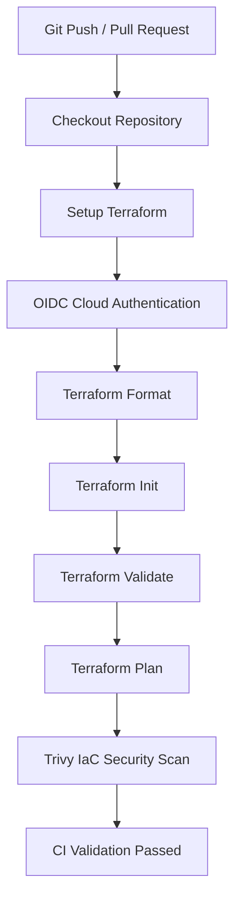

---

# Security Practices

The project implemented:

- AWS IAM Identity Center
- Temporary AWS credentials
- GitHub OIDC federation
- Azure OIDC federation
- Microsoft Entra federated identity
- Azure RBAC
- No long-lived AWS access keys in GitHub
- Least-privilege AWS CI permissions
- Terraform state excluded from Git
- Sensitive `.tfvars` excluded from Git
- Encrypted remote state
- Versioned AWS Terraform state
- S3 public-access blocking
- Terraform state locking
- Private subnet isolation
- Network segmentation
- Dedicated security groups
- Azure Network Security Groups
- Restricted SSH administration
- VPC endpoint-based AWS service connectivity
- Encrypted EC2 EBS storage
- IMDSv2 enforcement
- AWS Systems Manager
- Customer-managed KMS encryption
- Terraform tagging
- Terraform plan review
- Independent cloud API validation
- GitHub Actions CI
- Trivy IaC scanning
- HIGH/CRITICAL security quality gates
- State-aware Terraform refactoring
- Infrastructure drift validation

---

# Reusable Terraform Architecture

Reusable modules were introduced for both cloud providers.

```text
modules/
├── aws/
│   ├── monitoring/
│   ├── network/
│   └── security/
│
└── azure/
    ├── compute/
    ├── monitoring/
    ├── network/
    └── security/
```

The modular architecture separates concerns and allows infrastructure components to exchange resource IDs through explicit Terraform inputs and outputs.

---

# Repository Structure

```text
multi-cloud-devsecops-platform/
│
├── .github/
│   └── workflows/
│       ├── azure-terraform-ci.yml
│       └── terraform-ci.yml
│
├── docs/
│
├── modules/
│   ├── aws/
│   │   ├── monitoring/
│   │   ├── network/
│   │   └── security/
│   │
│   └── azure/
│       ├── compute/
│       ├── monitoring/
│       ├── network/
│       └── security/
│
├── scripts/
│
├── terraform/
│   ├── aws/
│   │   ├── backend.tf
│   │   ├── compute-iam.tf
│   │   ├── compute.tf
│   │   ├── main.tf
│   │   ├── oidc.tf
│   │   ├── outputs.tf
│   │   ├── providers.tf
│   │   ├── security-groups.tf
│   │   ├── variables.tf
│   │   ├── versions.tf
│   │   └── vpc-endpoints.tf
│   │
│   ├── azure/
│   │   ├── main.tf
│   │   ├── outputs.tf
│   │   ├── providers.tf
│   │   ├── security-groups.tf
│   │   ├── variables.tf
│   │   └── versions.tf
│   │
│   └── bootstrap/
│
├── .gitignore
└── README.md
```

Local Terraform state, provider working directories, plans, and sensitive configuration are intentionally excluded from source control.

---

# Technology Stack

## Infrastructure as Code

- Terraform
- Terraform modules
- Terraform remote state
- Terraform moved blocks

## AWS

- Amazon VPC
- Amazon EC2
- Amazon EBS
- Amazon S3
- AWS IAM
- IAM Identity Center
- AWS STS
- AWS Systems Manager
- AWS VPC Endpoints
- Amazon CloudWatch
- CloudWatch Logs
- Amazon SNS
- AWS KMS

## Microsoft Azure

- Azure Virtual Network
- Azure Subnets
- Network Security Groups
- Azure Linux Virtual Machines
- Azure Managed Identity
- Azure Storage
- Microsoft Entra ID
- Azure RBAC
- Azure Monitor Agent
- Azure Monitor
- Data Collection Rules
- Log Analytics Workspace

## DevOps / DevSecOps

- Git
- GitHub
- GitHub Actions
- GitHub OIDC
- Trivy
- AWS CLI
- Azure CLI
- Bash
- Visual Studio Code

## Workloads

- Linux
- Amazon Linux 2023
- Ubuntu 24.04 LTS
- Nginx

---

# Project Roadmap

| Phase | Engineering Milestone | Status |
| --- | --- | --- |
| 1 | AWS Networking Foundation | Complete |
| 2 | Terraform CI and IaC Security | Complete |
| 3 | GitHub OIDC and Secure AWS CI/CD | Complete |
| 4 | AWS Compute, Systems Management and Private Connectivity | Complete |
| 5 | Azure Compute and Secure Workload Deployment | Complete |
| 6 | Azure CI/CD, Identity and Multi-Cloud Integration | Complete |
| 7 | Reusable AWS Terraform Modules | Complete |
| 8 | AWS Security Hardening and CI Validation | Complete |
| 9 | AWS Monitoring, Logging and Observability | Complete |
| 10 | Azure Terraform Modularization and Architecture Refactoring | Complete |
| 11 | Azure Monitoring, Logging and Observability | Complete |
| Closure | Validation, Documentation and Controlled AWS Teardown | Complete |

---

# Phase 1 — AWS Networking Foundation

**Status: Complete**

The first phase established the AWS networking foundation.

Implemented:

- AWS VPC
- Public subnet
- Private application subnet
- Management subnet
- Internet Gateway
- Public route table
- Internet routing
- Route-table association
- Terraform outputs
- Terraform tagging

The lifecycle was:

```text
Design
  ->
Define as Code
  ->
Validate
  ->
Plan
  ->
Review
  ->
Deploy
  ->
Verify
  ->
Version Control
```

This established the initial infrastructure foundation for the multi-cloud platform.

---

# Phase 2 — Terraform CI and IaC Security

**Status: Complete**

GitHub Actions was introduced to automatically validate Terraform infrastructure changes.

The pipeline included:

- Terraform formatting verification
- Terraform initialization
- Terraform validation
- Terraform planning
- Trivy IaC scanning
- HIGH/CRITICAL security quality gate
- Push and pull-request validation

During implementation, automated security scanning identified automatic public IPv4 assignment as a security concern.

The Terraform configuration was remediated and independently revalidated.

```text
Detect
  ->
Analyze
  ->
Remediate
  ->
Plan
  ->
Deploy
  ->
Verify
  ->
Re-scan
  ->
Pass
```

---

# Phase 3 — GitHub OIDC and Secure AWS CI/CD Integration

**Status: Complete**

GitHub Actions authentication was migrated to OpenID Connect federation.

This removed the requirement for long-lived AWS credentials in GitHub.

Implemented:

- GitHub OIDC provider
- AWS STS federation
- GitHub Actions IAM role
- Least-privilege CI access
- AWS identity verification
- S3 remote Terraform backend
- Terraform state encryption
- Terraform state versioning
- Terraform state locking
- Public access blocking

Secure workflow:

```text
Push / Pull Request
        ->
GitHub OIDC
        ->
AWS STS
        ->
CI IAM Role
        ->
S3 Remote State
        ->
Terraform Validate
        ->
Terraform Plan
        ->
Trivy
        ->
Pass
```

---

# Phase 4 — AWS Compute, Systems Management and Private Service Connectivity

**Status: Complete**

The AWS platform was extended beyond networking into compute and workload management.

Implemented:

- Amazon Linux 2023 ARM64
- `t4g.micro`
- Encrypted GP3 storage
- IMDSv2
- EC2 IAM role
- Instance profile
- AWS Systems Manager
- S3 Gateway VPC Endpoint
- SSM Interface VPC Endpoint
- SSM Messages Interface VPC Endpoint
- Endpoint security controls
- Nginx installation
- HTTP workload validation

Nginx returned:

```text
HTTP/1.1 200 OK
Server: nginx
```

Systems Manager connectivity was independently verified.

The complete AWS CI pipeline subsequently passed.

---

# Phase 5 — Azure Compute and Secure Workload Deployment

**Status: Complete**

Azure was introduced as the project's second cloud environment.

Implemented:

- Azure VNet
- Network segmentation
- Linux VM
- Ubuntu 24.04 LTS
- Static Standard Public IP
- Network Interface
- Network Security Groups
- Restricted administrative SSH
- ED25519 authentication
- Managed Identity
- Nginx
- Terraform deployment

Validation included:

- Terraform plan
- Terraform apply
- Azure CLI
- SSH authentication
- Linux system validation
- Nginx validation
- HTTP 200 health check

Workflow:

```text
Terraform
   ->
Azure VNet
   ->
NSG Security
   ->
Linux VM
   ->
SSH Authentication
   ->
Nginx
   ->
Application Validation
```

---

# Phase 6 — Azure CI/CD, Identity and Multi-Cloud Integration

**Status: Complete**

Azure was integrated into the CI/CD architecture.

Implemented:

- GitHub Actions Azure workflow
- Azure OIDC authentication
- Microsoft Entra application
- Service principal
- Federated identity credential
- Resource-group scoped Contributor RBAC
- Azure remote Terraform state
- Secure Terraform state container
- TLS 1.2
- GitHub repository variables
- Terraform initialization
- Terraform validation
- Terraform planning
- Azure CLI verification

Final CI validation:

```text
Checkout Repository          PASSED
Setup Terraform              PASSED
Azure Login with OIDC        PASSED
Terraform Init               PASSED
Terraform Format Check       PASSED
Terraform Validate           PASSED
Terraform Plan               PASSED
Azure CLI Verification       PASSED
Complete Job                 PASSED
```

---

# Phase 7 — Reusable AWS Terraform Modules

**Status: Complete**

AWS infrastructure was refactored into reusable modules while preserving existing resources.

## Network Module

```text
modules/aws/network/
```

Managed:

- VPC
- Public subnet
- Private application subnet
- Management subnet
- Internet Gateway
- Route table
- Internet route
- Route-table association

## Security Module

```text
modules/aws/security/
```

Managed:

- Web security group
- Application security group
- Endpoint security group
- HTTP/HTTPS ingress
- Web-to-application traffic
- S3 endpoint access
- Security-group egress

Terraform `moved` blocks preserved existing infrastructure during the refactor.

Validation:

```text
Terraform validation          PASSED
Network module migration      PASSED
Security module migration     PASSED
Infrastructure recreation     NONE
Final Terraform plan          NO CHANGES
Resources added               0
Resources destroyed           0
```

---

# Phase 8 — AWS Security Hardening and CI Validation

**Status: Complete**

Automated IaC scanning identified unrestricted security-group egress.

Security rules were hardened to restrict internal outbound traffic to:

```text
10.20.0.0/16
```

The security architecture included:

- Public web security group
- Private application security group
- VPC endpoint security group
- HTTP/HTTPS ingress controls
- Web-to-application restrictions
- S3 prefix-list access
- VPC-scoped egress
- Dedicated Terraform security-group rule resources

An existing AWS security-group rule was reconciled with Terraform state to prevent duplicate creation.

Remediation lifecycle:

```text
Detect
  ->
Analyze
  ->
Remediate
  ->
Plan
  ->
Reconcile
  ->
Apply
  ->
Verify
  ->
Re-scan
  ->
Pass
```

Final validation:

```text
Terraform validation     PASSED
Terraform apply          PASSED
Final Terraform plan     NO CHANGES
```

---

# Phase 9 — AWS Monitoring, Logging and Observability

**Status: Complete**

Phase 9 introduced centralized monitoring and observability for the AWS workload.

Implemented:

- CloudWatch Logs
- CloudWatch Agent
- Nginx access logging
- Nginx error logging
- High CPU alarm
- EC2 status-check alarm
- SNS alerting
- Customer-managed KMS encryption
- KMS automatic rotation
- Terraform-managed KMS alias
- CloudWatch Logs VPC Endpoint
- Private DNS
- Terraform monitoring module
- GitHub Actions validation
- Trivy security scanning

Monitoring module:

```text
modules/aws/monitoring/
```

Architecture:

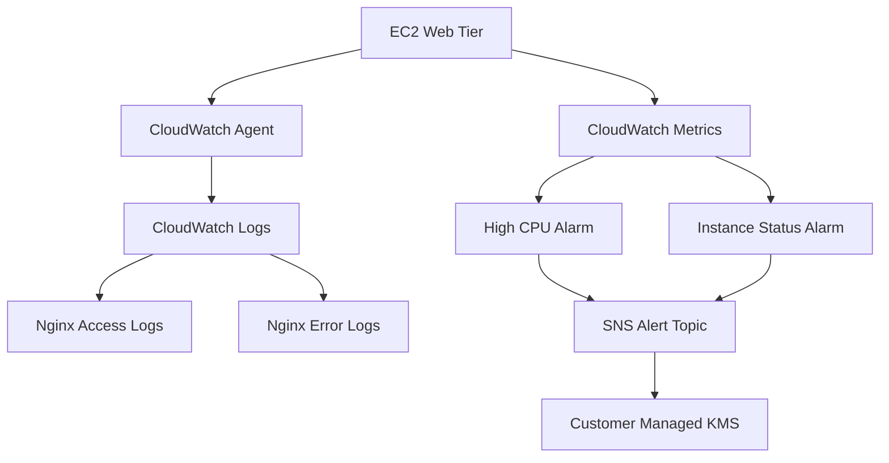

The SNS topic was protected by a dedicated customer-managed KMS key.

The final CI validation passed:

```text
AWS OIDC Authentication        PASSED
AWS Network Read Access        PASSED
Terraform Format Check         PASSED
Terraform Init                 PASSED
Terraform Validate             PASSED
Terraform Plan                 PASSED
Trivy IaC Security Scan        PASSED
Terraform Validation Workflow  PASSED
```

Final Terraform verification:

```text
No changes. Your infrastructure matches the configuration.
```

---

# Phase 10 — Azure Terraform Modularization and Architecture Refactoring

**Status: Complete**

Azure infrastructure was refactored from a root-module implementation into reusable Terraform modules.

```text
modules/azure/

├── network/
│   ├── main.tf
│   ├── variables.tf
│   └── outputs.tf
│
├── security/
│   ├── main.tf
│   ├── variables.tf
│   └── outputs.tf
│
└── compute/
    ├── main.tf
    ├── variables.tf
    └── outputs.tf
```

## Network Module

Managed:

- Azure Virtual Network
- Web subnet
- Application subnet
- Management subnet
- Network outputs

## Security Module

Managed:

- Web NSG
- Application NSG
- Management NSG
- HTTPS rule
- Restricted SSH rule
- NSG/subnet associations

## Compute Module

Managed:

- Static Standard Public IP
- Network Interface
- Linux VM
- SSH authentication
- Managed Identity
- Ubuntu image
- Nginx cloud-init

Terraform `moved` blocks migrated state addresses without destroying live resources.

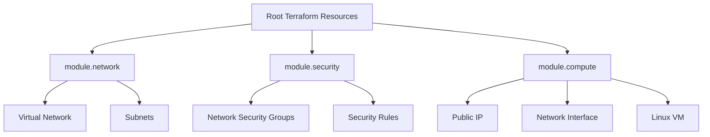

Validation lifecycle:

```text
Refactor
  ->
Format
  ->
Init
  ->
Validate
  ->
Plan
  ->
Apply State Migration
  ->
Re-Plan
  ->
CI Validation
```

Final result:

```text
Success! The configuration is valid.

0 to add
0 to change
0 to destroy

No changes. Your infrastructure matches the configuration.
```

---

# Phase 11 — Azure Monitoring, Logging and Observability

**Status: Complete**

Phase 11 completed the Azure observability architecture and brought the Azure environment to functional parity with the monitoring principles implemented in AWS.

A dedicated Terraform monitoring module was introduced:

```text
modules/azure/monitoring/
├── main.tf
├── variables.tf
└── outputs.tf
```

The module implemented:

- Log Analytics Workspace
- Azure Monitor Agent
- Data Collection Rule
- Data Collection Rule association
- Performance counter collection
- Terraform tagging
- Integration with the existing Azure Linux VM

---

## Azure Monitor Architecture

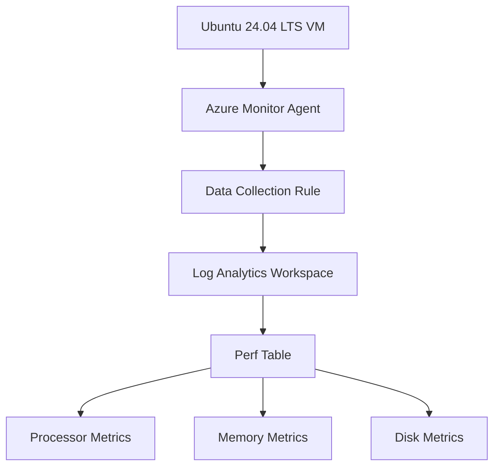

---

## Data Collection Rule

The Azure Data Collection Rule was configured to collect Linux performance counters every 60 seconds.

The final counter configuration included:

```text
\Processor(*)\% Processor Time

\Memory\% Available Memory

\Logical Disk(*)\% Free Space
```

The monitoring configuration was associated with:

```text
vm-multicloud-dev-web
```

using a Terraform-managed Data Collection Rule association.

---

## Azure Monitor Agent

The Azure Monitor Linux Agent was installed and managed through the Azure VM extension.

The agent services were independently verified as active and running.

The effective agent configuration contained the expected CPU, memory, and disk counters.

---

## Log Analytics Validation

The final Log Analytics query successfully returned all three metric families.

### CPU

Observed processor instances included:

```text
cpu0
cpu1
total
```

Counter:

```text
% Processor Time
```

### Memory

Counter:

```text
% Available Memory
```

The successful query returned values of approximately:

```text
78.5% - 78.6% available memory
```

during final validation.

### Disk

Counter:

```text
% Free Space
```

Disk instances included:

```text
/
/boot
/boot/efi
/dev
/dev/shm
/run
/run/lock
total
```

This confirmed end-to-end collection from:

```text
Linux VM
   ->
Azure Monitor Agent
   ->
Data Collection Rule
   ->
Log Analytics Workspace
   ->
Perf Table
   ->
KQL Query
```

---

## Phase 11 Troubleshooting and Engineering Validation

During implementation, disk telemetry appeared first while CPU and memory metrics were initially absent from Log Analytics.

Troubleshooting included:

- Inspecting the Terraform DCR configuration
- Inspecting the deployed Azure Data Collection Rule
- Inspecting Azure Monitor Agent configuration
- Verifying AMA package and extension versions
- Inspecting generated counter definitions
- Inspecting MDSD counter configuration
- Reviewing Azure Monitor Agent logs
- Comparing requested counters with effective Linux counters
- Querying the `Perf` table directly
- Updating Linux-compatible performance counter definitions
- Applying the corrected Terraform configuration
- Revalidating telemetry ingestion

The final effective counters were:

```text
% Processor Time
% Available Memory
% Free Space
```

and all were successfully observed in Log Analytics.

---

## Phase 11 Terraform Validation

Terraform validation returned:

```text
Success! The configuration is valid.
```

The monitoring configuration was applied successfully.

The final Terraform apply updated the Azure Data Collection Rule without recreating the surrounding infrastructure.

Subsequent validation confirmed that the monitoring configuration was active and telemetry was being ingested.

---

## Phase 11 Result

Phase 11 completed Azure monitoring and observability through Terraform-managed Azure Monitor infrastructure.

The completed implementation demonstrated:

- Azure Monitor Agent deployment
- Data Collection Rules
- Log Analytics integration
- Linux performance counters
- CPU monitoring
- Memory monitoring
- Disk monitoring
- KQL-based telemetry validation
- Terraform-managed observability
- Troubleshooting of agent/counter behavior
- End-to-end monitoring validation

**Phase 11 milestone status: COMPLETE**

---

# Multi-Cloud Observability Architecture

With Phases 9 and 11 complete, the project implemented monitoring on both cloud platforms.

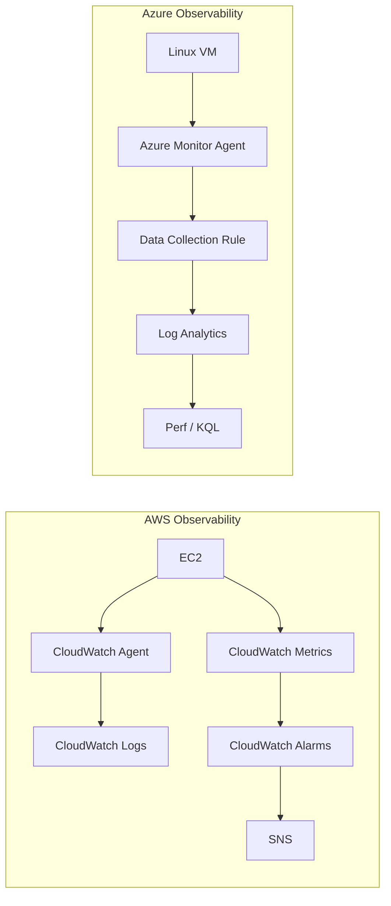

This demonstrates provider-native observability while maintaining the same engineering principle:

```text
Workload
   ->
Telemetry Agent
   ->
Cloud Monitoring Platform
   ->
Centralized Telemetry
   ->
Operational Validation
```

---

# Infrastructure Lifecycle and Cost Management

Building infrastructure was only one part of the project.

The AWS environment was deliberately decommissioned after final validation to demonstrate controlled infrastructure lifecycle management and prevent unnecessary ongoing cloud charges.

The process was performed through Terraform rather than manually deleting workload resources from the AWS Console.

---

## Pre-Destruction Validation

Before destruction:

```text
Terraform AWS state count: 38
```

Terraform confirmed:

```text
No changes. Your infrastructure matches the configuration.
```

This established that Terraform state and the live AWS infrastructure were synchronized before teardown.

---

## Destruction Plan

A dedicated Terraform destruction plan was generated and reviewed before execution.

```text
Plan: 0 to add, 0 to change, 37 to destroy.
```

The plan was saved before execution.

This allowed the exact destructive operations to be reviewed before applying them.

---

## Controlled AWS Teardown

Terraform successfully completed the workload teardown:

```text
Apply complete! Resources: 0 added, 0 changed, 37 destroyed.
```

The teardown removed the project workload infrastructure including:

- EC2 instance
- EBS workload volume
- VPC workload resources
- Subnets
- Internet Gateway
- Route tables
- Security groups
- Security-group rules
- VPC endpoints
- CloudWatch alarms
- CloudWatch log group
- SNS alerting resources
- Project IAM resources
- Monitoring infrastructure

---

## Post-Destruction Verification

Independent AWS CLI verification was performed after Terraform completed.

The checks confirmed no remaining project workload resources for:

```text
EC2 Instances
EBS Volumes
Elastic IPs
NAT Gateways
VPC Endpoints
Load Balancers
CloudWatch Alarms
CloudWatch Log Groups
SNS Topics
Project IAM Roles
GitHub Project OIDC Infrastructure
```

---

## KMS Lifecycle

Two KMS keys were observed after workload destruction.

### AWS-managed EBS key

```text
alias/aws/ebs
KeyManager: AWS
```

This is an AWS-managed service key and was intentionally left untouched.

### Project customer-managed key

The project KMS key used for encrypted SNS alerts entered:

```text
KeyManager: CUSTOMER
KeyState: PendingDeletion
Description: KMS key for Multi-Cloud DevSecOps SNS alerts
```

This confirmed that the project-specific customer-managed key entered the AWS KMS deletion lifecycle.

---

# Terraform Backend Retention

The AWS Terraform backend was intentionally retained after workload teardown.

Bucket:

```text
multi-cloud-devsecops-tfstate-<account-id>-euc1
```

State path:

```text
terraform/aws/terraform.tfstate
```

The backend remains:

```text
Versioning: Enabled
Encryption: AES256 / SSE-S3
```

Retaining the backend preserves:

- Terraform state history
- Infrastructure lifecycle evidence
- Previous state versions
- Portfolio/redeployment reference
- Recovery information

The backend can be removed separately when long-term state retention is no longer required.

---

# Deployment and Destruction Lifecycle

The project therefore demonstrates the complete infrastructure lifecycle:

```mermaid
flowchart LR

    DESIGN["Design"]
    CODE["Terraform Code"]
    CI["CI / Security Scan"]
    PLAN["Plan"]
    DEPLOY["Deploy"]
    VERIFY["Verify"]
    MONITOR["Monitor"]
    DOCUMENT["Document"]
    DESTROYPLAN["Destroy Plan"]
    DESTROY["Controlled Destroy"]
    VERIFY2["Post-Destroy Verification"]

    DESIGN --> CODE
    CODE --> CI
    CI --> PLAN
    PLAN --> DEPLOY
    DEPLOY --> VERIFY
    VERIFY --> MONITOR
    MONITOR --> DOCUMENT
    DOCUMENT --> DESTROYPLAN
    DESTROYPLAN --> DESTROY
    DESTROY --> VERIFY2
```

This is a deliberate part of the project architecture rather than an accidental cleanup exercise.

---

# Validation Summary

The project used multiple independent validation layers.

## Terraform

```text
terraform fmt
terraform init
terraform validate
terraform plan
terraform apply
terraform state
terraform destroy
```

## AWS

Validation used:

- AWS CLI
- AWS Systems Manager
- Terraform state
- CloudWatch
- GitHub Actions
- Trivy
- Nginx HTTP validation

## Azure

Validation used:

- Azure CLI
- SSH
- Linux commands
- Terraform
- GitHub Actions
- Azure Monitor
- Log Analytics
- KQL
- Nginx HTTP validation

---

# Security Remediation Model

A recurring engineering pattern throughout the project was:

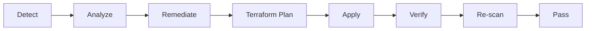

Examples included:

- Public IPv4 configuration
- Security-group egress
- Terraform state reconciliation
- SNS encryption
- KMS access
- GitHub Actions least-privilege permissions
- Azure Monitor Linux performance counters

---

# Engineering Skills Demonstrated

## Cloud Infrastructure

- AWS infrastructure engineering
- Azure infrastructure engineering
- VPC/VNet design
- Subnetting
- Routing
- Security groups
- Network Security Groups
- Compute provisioning
- Linux administration
- Cloud-native management services

## Infrastructure as Code

- Terraform
- Terraform modules
- Terraform state
- Remote state
- State migration
- `moved` blocks
- Imports/state reconciliation
- Terraform lifecycle management
- Infrastructure teardown

## Identity

- AWS IAM
- IAM Identity Center
- AWS STS
- GitHub OIDC
- Microsoft Entra ID
- Azure OIDC
- Azure RBAC
- Managed Identity

## DevOps

- Git
- GitHub
- GitHub Actions
- CI/CD
- Infrastructure validation
- Automated Terraform planning

## DevSecOps

- Trivy IaC scanning
- Security quality gates
- Least privilege
- Security remediation
- KMS encryption
- Secure remote state
- Federated credentials

## Observability

- CloudWatch
- CloudWatch Agent
- CloudWatch Logs
- CloudWatch alarms
- SNS
- Azure Monitor
- Azure Monitor Agent
- Data Collection Rules
- Log Analytics
- KQL
- Linux performance counters

## Operational Engineering

- Troubleshooting
- Drift detection
- Live infrastructure validation
- Cloud CLI validation
- State-aware refactoring
- Controlled destruction
- Cost-conscious infrastructure lifecycle management

---

# Key Engineering Outcomes

The project progressed substantially beyond simply deploying cloud resources.

It demonstrates the ability to:

1. Design cloud networks.
2. Represent infrastructure as Terraform code.
3. Secure cloud workloads.
4. Build Linux compute infrastructure.
5. Integrate cloud-native management services.
6. Implement federated identity.
7. Build CI/CD pipelines.
8. Implement IaC security scanning.
9. Remediate security findings.
10. Refactor live infrastructure without recreating it.
11. Implement provider-native monitoring.
12. Troubleshoot telemetry pipelines.
13. Independently validate infrastructure.
14. Detect configuration drift.
15. Manage Terraform remote state.
16. Safely destroy infrastructure when it is no longer required.

---

# Project Evolution

The engineering maturity of the platform developed incrementally:

```text
AWS Networking
      ↓
Terraform Infrastructure as Code
      ↓
CI/CD
      ↓
IaC Security
      ↓
OIDC Federation
      ↓
AWS Compute
      ↓
Systems Management
      ↓
Azure Infrastructure
      ↓
Multi-Cloud CI/CD
      ↓
Reusable Terraform Modules
      ↓
Security Hardening
      ↓
AWS Observability
      ↓
Azure State-Aware Refactoring
      ↓
Azure Observability
      ↓
Lifecycle Validation
      ↓
Controlled Infrastructure Teardown
```

---

# Portfolio Significance

This project provides hands-on evidence of experience across several responsibilities commonly associated with Cloud Infrastructure, Cloud Engineering, Platform Engineering, DevOps, and Infrastructure Engineering roles.

Rather than presenting isolated Terraform examples, the repository demonstrates an infrastructure lifecycle involving:

```text
Architecture
+
Networking
+
Compute
+
Identity
+
Security
+
Infrastructure as Code
+
CI/CD
+
Observability
+
Troubleshooting
+
State Management
+
Lifecycle Management
```

The project also records troubleshooting and remediation work rather than presenting only the final successful configuration.

---

# Final Project Result

Project 3 successfully delivered a Terraform-managed multi-cloud DevSecOps infrastructure platform spanning AWS and Microsoft Azure.

The final implementation demonstrated:

- Multi-cloud architecture
- AWS and Azure networking
- Linux compute
- Infrastructure as Code
- Reusable Terraform modules
- Remote state
- GitHub Actions
- AWS and Azure OIDC federation
- Least-privilege access
- Automated security scanning
- Security remediation
- State-aware infrastructure refactoring
- AWS CloudWatch observability
- Azure Monitor observability
- Log Analytics
- KQL
- Infrastructure drift validation
- Controlled Terraform destruction
- Cloud cost management
- Technical documentation

```text
PROJECT 3
MULTI-CLOUD DEVSECOPS INFRASTRUCTURE AUTOMATION PLATFORM

STATUS: COMPLETE
```

---

# Next Portfolio Project

The next stage of the Cloud & Infrastructure Engineering portfolio moves from VM-centric multi-cloud infrastructure into container orchestration and cloud-native platform engineering.

## Project 4 — Kubernetes & Cloud-Native Platform Engineering

Planned areas include:

- Containers
- Docker
- Kubernetes
- Kubernetes networking
- Deployments
- Services
- ConfigMaps
- Secrets
- Ingress
- Persistent storage
- Helm
- Kubernetes security
- Observability
- Infrastructure automation
- CI/CD
- Cloud-native deployment patterns

Project 4 will build on the Terraform, cloud networking, security, CI/CD, Linux, identity, and observability foundations demonstrated in this project.

---

## Completion

**Multi-Cloud DevSecOps Infrastructure Automation Platform — COMPLETE**